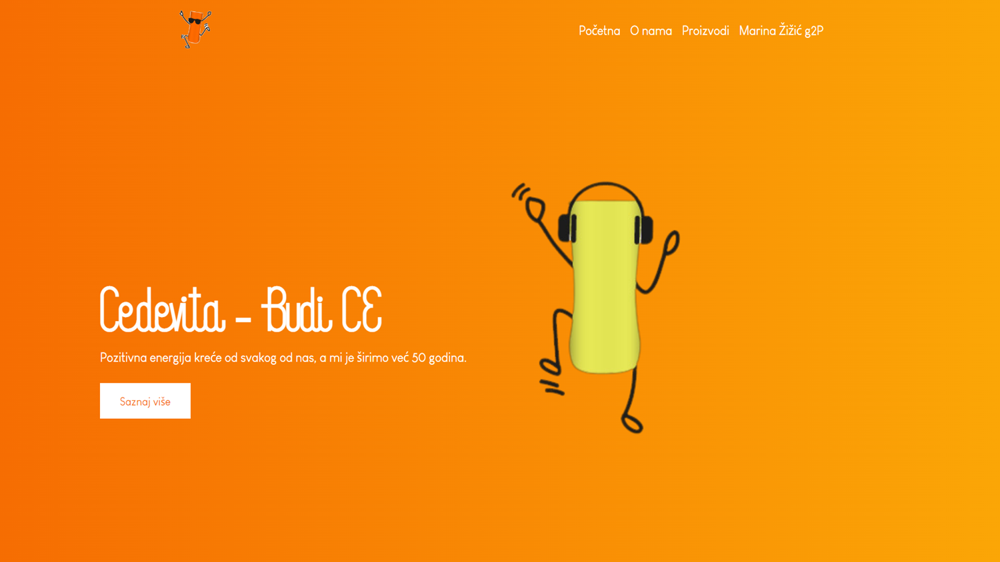

# Cedevita

An interactive web application dedicated to showcasing Cedevita, capturing its essence through engaging features and content.

## Deadline

The project deadline is June 6, 2024.

## Installation

To run this project locally, follow these steps:

1. Clone the repository: `git clone https://github.com/marinazizic/CedevitaProject.git`
2. Navigate into the project directory: `cd CedevitaProject`
3. Install dependencies: `npm install`
4. Start the development server: `npm start`

## Features

- Interactive components showcasing different aspects of Cedevita
- Dynamic content updates using useState and useEffect hooks
- Responsive design for optimal viewing on various devices
- Deployed on Vercel for easy access and reliable performance

## Contact

For questions and feedback please reach out to:

- Marina Žižić
- Email: marinazizicc@gmail.com
- GitHub: [marinazizic](https://github.com/marinazizic)
